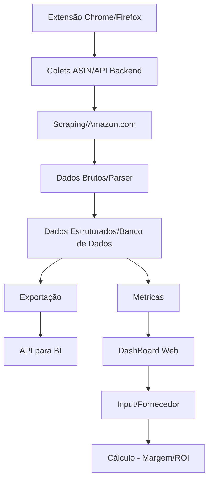

# 🕵️ Product Hunter - Market Intelligence Tool

> *Status do Projeto:* 🛠️ Em desenvolvimento (Acadêmico)

Ferramenta acadêmica voltada para a análise de inteligência de mercado na *Amazon*. O projeto foi idealizado para fins educacionais, focando no estudo de técnicas de scraping, análise de dados e arquitetura de software de alta performance.

---

## 📋 Sobre o Projeto

Este repositório contém a especificação e documentação de uma ferramenta de Product Hunting inspirada em soluções líderes de mercado, como:
* *LOOT*
* *Jungle Scout*
* *Helium 10*

O objetivo central é criar um sistema robusto que auxilie sellers da Amazon a identificar oportunidades de negócio estratégicas através da análise profunda de dados.

---

## ⚠️ IMPORTANTE

Este é um projeto *exclusivamente acadêmico*, desenvolvido para a aplicação prática de conceitos explorados nas seguintes disciplinas:

* *Engenharia de Software:* Padrões de projeto e ciclo de vida de desenvolvimento.
* *Análise de Dados:* Processamento e geração de insights a partir de grandes volumes de informações.
* *Web Scraping:* Coleta automatizada de dados públicos na web.
* *Arquitetura de Sistemas:* Estruturação de componentes e escalabilidade.

---

## 🚀 Tecnologias e Conceitos Explorados

* *Extração de Dados:* Técnicas de scraping para extrair preços, rankings e reviews.
* *Inteligência de Mercado:* Dashboards e métricas de conversão.
* *Documentação:* Especificações técnicas e diagramas de arquitetura.

### Fluxo de Dados (Diagrama)

---

## 👨‍💻 Autor
Geyson Grube
---
Desenvolvido como parte do currículo acadêmico de tecnologia.

